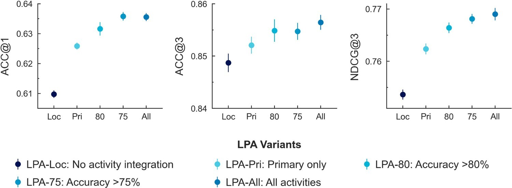
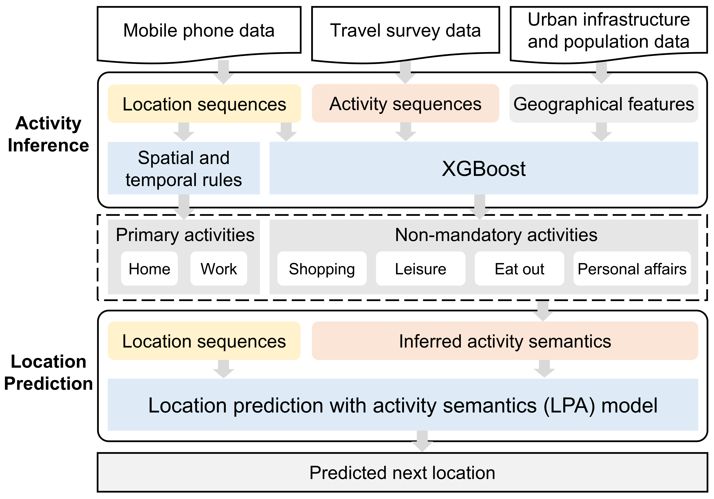

<h1 align="center">LPA: Location Prediction with Activity Semantics</h1>

<div align="center">

  [](https://github.com/nehSgnaiL/LPA/pulls)
  [](https://github.com/nehSgnaiL/LPA/stargazers)
  [](https://github.com/nehSgnaiL/LPA/issues)
  [](https://github.com/nehSgnaiL/LPA/pulls)

</div>

## Overview

This repository contains the code and sample data for the LPA model from [our paper](https://doi.org/10.1080/17538947.2025.2552880), *Improving Next Location Prediction with Inferred Activity Semantics in Mobile Phone Data*.

> To predict the '*where*,' do we need the '*why*'? By adding inferred travel purposes into an AI model, we find that **understanding the reasons behind trips makes predictions more accurate**, and **considering many activity types works better than relying only on a few highly accurate ones**.

<p align="center">
  
</p>
<p align = "center">
<b>Fig. 1</b>. Diverse but uncertain inferred activities still enhance predictions.
</p>

Specifically, a semantics-enhanced framework is proposed to infer and integrate user activities into an LSTM architecture with multimodal embeddings and attention mechanisms. 

<p align="center">
  
</p>
<p align = "center">
<b>Fig. 2</b>. Research framework.
</p>

## Table of contents

- [Overview](#Overview)
- [Structure](#Structure)
- [Quick-start](#Quick-start)

## Structure

The repository is developed using the following libraries: [Pytorch](https://github.com/pytorch/pytorch) and [LibCity](https://github.com/LibCity/Bigscity-LibCity).

Directory and file descriptions:

+ `data`: Contains sample data for running the framework (data format requirements align with LibCity). 

+ `downstream` & `embed`: Define the LPA model for next-location prediction.

+ `utils`: Supplementary code for running the framework.

+ `args.py`: Default configuration settings for the framework.

+ `dataset.py`: Functions for reading and loading data.

+ `evaluator.py`: Evaluation functions to assess framework performance.

+ `executor.py`: Defines the training process of the framework.

+ `pipeline.py`: Pipeline for executing the framework.

+ `main.py`: Main script to run the framework.

+ `run.sh`: Shell script to run the framework with default configurations.

## Quick-start
**Step 1. Set Configuration in `args.py`**

> [!NOTE] 
> The key parameter `activity_type` in `args.py` determines the activity type integrated into the model: 
> + **None**: The model uses only location data.
> + **A3**: The model integrates location data and primary activities (Home, Work, Non-mandatory).
> + **A6**: The model integrates location data, primary activities, and non-mandatory activities (Home, Work, Shopping, Leisure, Eat out, Personal affairs).

**Step 2. Run the Framework**

> [!NOTE] 
> Execute `main.py` to start the framework. Note the following:
> + The configurations in `args.py` are default settings.
> + Any configurations set directly in `main.py` will overwrite the default config.

> [!TIP]
> Using the command to run the framework without modifying the code:
> ```python
> python main.py --pre_model_name=LPA --activity_type=A6 --dataset=data_sample
> ```
> or using a shell script:
> ```bash
> bash run.sh
> ```


**Step 3. Check the Results**

> [!NOTE] 
> Upon successful completion, a `cache` directory will be generated containing:
> + Training logs
> + Cached datasets
> + Model checkpoints

## Citation

If you consider it useful for your research or development, please consider citing our [paper](https://doi.org/10.1080/17538947.2025.2552880).

```
@article{IJDE2025LPA,
    author = {Shen Liang and Qiuping Li and Li Zhuo and Dan Zou and Yang Xu and Suhong Zhou},
    title = {Improving next location prediction with inferred activity semantics in mobile phone data},
    journal = {International Journal of Digital Earth},
    volume = {18},
    number = {2},
    pages = {2552880},
    year = {2025},
    publisher = {Taylor \& Francis},
    doi = {10.1080/17538947.2025.2552880},
}
```
